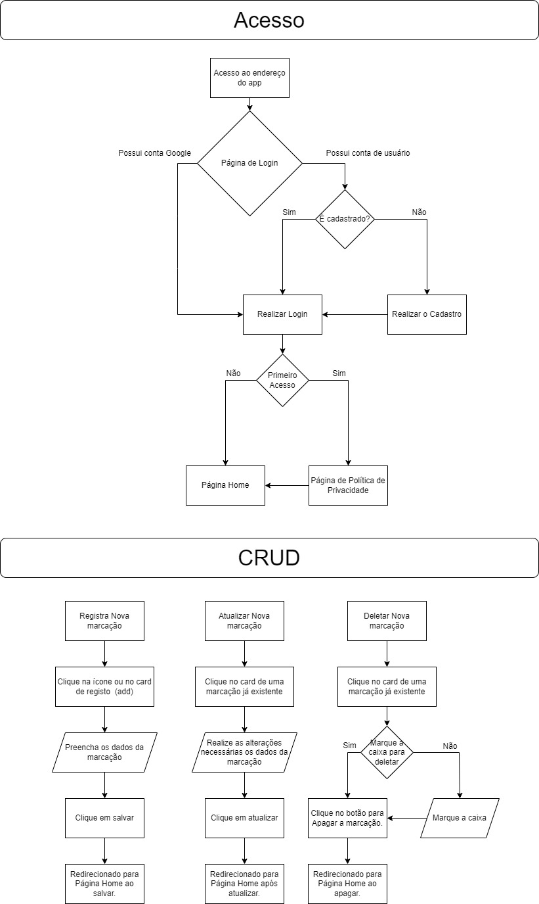

# OhBookmark 

 Atenção! Projeto inicialmente desenvolvido para aparelhos mobiles, responsividade para desktop ainda em andamento, então ao realizar o passeio pela aplicação, use seu aparelho mobile ou utilize o navegador (no desktop) em modo de desenvolvedor mobile (no Google Chrome pressione "CONTROL+SHIFT+I" e depois "CONTROL+SHIFT+M" nessa ordem e boa viagem, aproveite e LEIA A DOCUMENTAÇÃO ABAIXO) Clique aqui para realizar um passeio pela aplicação.

## Descrição

 O projeto Bookmark tem como foco ser uma aplicação para que o usuário possa realizar o controle de séries, livros e quadrinhos evitando assim, perder páginas, episódios e etc, e assim não se lembrar onde parou. A Aplicação tem foco e pessoas como eu que tenho atualmente cadastrado em meu perfil 241 quadrinho, 4 livros e 13 séries (oque faz com que seja muito comum eu não me recordar em qual página parei ou em qual episódio estou) rs, mais e você? Quantos obras você acompanha no momento?

## Concepção inicial para o layout da aplicação

 Atenção! O projeto está em desenvolvimento, então esse layout foi a elaboração inicial e existe a possibilidade de alterações serem realizadas.

## Fluxograma Elaborado para realização do acesso até a página home e fluxo para os procedimentos do CRUD.

Atenção! O projeto está em desenvolvimento, então esse fluxograma foi a elaboração inicial para que fosse iniciado o processo de desenvolvimento e existe a possibilidade de alterações serem realizadas.

## Software, framework e outros usados no processo de desenvolvimento.

 O Layout/UX inicial foi realizado no site [FIGMA](https://www.figma.com/).

 O fluxograma foi feito no site [Diagrams](https://www.diagrams.net/).

 O projeto está sendo desenvolvido no framwork [Angular](https://angular.io/).

 A parte de armazenamento, banco de dados assim como a authenticação de usuário está construida com [Firebase](https://firebase.google.com/?hl=pt-br).

 Linguagem de programação mais utilizada foi [Typescript](https://www.typescriptlang.org/)

 Projeto está em seu processo inicial, então futuramente irei preparar para vocês um "readme" mais detalhado. Desde já, grato!
